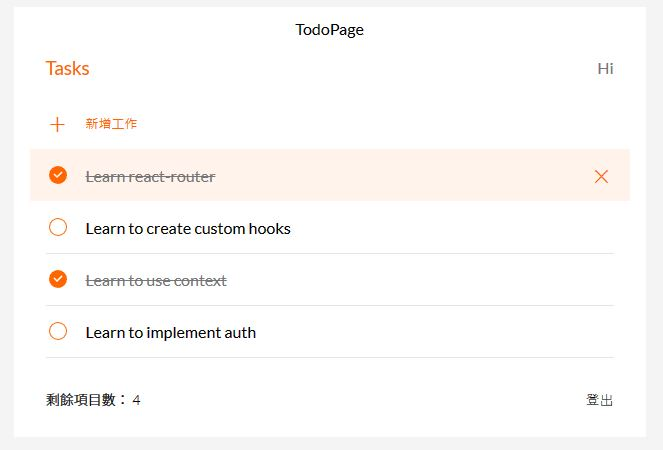

# ✨Todo List - React [DEMO](https://ywcheng1207.github.io/AC_TODOLIST-REACT-STARTER/login)

## 👋 Welcome

這是一份基於 React 框架製作的 Todo List 專案。

## ✨ Features

使用者可以 - 註冊、登入、登出 帳號 - 新增、編輯、刪除 todos

## ✨ Start the project

1.  確認已經安裝 node.js 與 npm
2.  clone 專案
3.  終端機進入資料夾並輸入：`$ npm install `
4.  安裝完畢後，繼續輸入：`$ npm run start`
5.  瀏覽器輸入網址：
    - 首頁: `http://localhost:3000`
    - login: `http://localhost:3000/login`
    - signup: `http://localhost:3000/signup`
    - todo: `http://localhost:3000/todo`
6.  若要暫停使用，可在終端機執行：`ctrl + c`
